# Serverless Framework | AWS | REST API With DynamoDB | Custom domain

## Architecture



## Requirement

- Serverless Framework : 2.11.0
- Node.js : v14.13.1

```shell
$ sls -v           
Framework Core: 2.11.0
Plugin: 4.1.2
SDK: 2.3.2
Components: 3.3.0

$ node -v
v14.13.1
```

## Setup
```shell
$ npm install
```

## Create Domain

```shell
$ sls create_domain
```

## Deploy

```shell
$ sls deploy
```

## Remove

```shell
$ sls remove
```

## Delete Delete

```shell
$ sls delete_domain
```